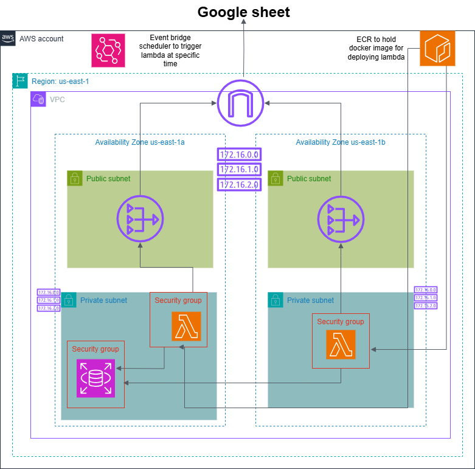

# Football Racing Barchart App
This project builds a solution to automate data extraction from AWS RDS to Google Sheets by using AWS LAMBDA function that is triggered at specific schedule by EventBridge
## 📝 Table of Contents
- [System Architecture](#system-architecture)
- [Setup & Requirements](#-setup--requirements)
- [Usage](#-usage)
- [Notes](#-notes)

## System Architecture

## 🛠 Setup & Requirements
1. **Aws Account**: Ensure you have an active AWS account.
2. **Knowledge required**: RDS, Lambda, EventBridge, VPC, NAT gateway, ECR, Docker
3. **Python Libraries**: Can be found in `requirements.txt`

## 🚀 Usage
1. **Docker image for lambda function**: Build a docker image from the Dockerfile and push it to AWS ECR.
2. **create approriate VPC**: 
- I used VPC spanning 2 AZs, each AZ has 2 subnet (a private and a public one).
- Create Nat gateway to provide internet-outbound traffic for the lambda function (remember to create elastic IPs for the Nat gateway).
3. **Lamba function creation**: 
- Deploy a lambda function with the docker image on ECR.
- Provide the approriate environment variables.
3. **Create EventBridge schedule**: Create EventBridge schedule to trigger lambda function at specific time.